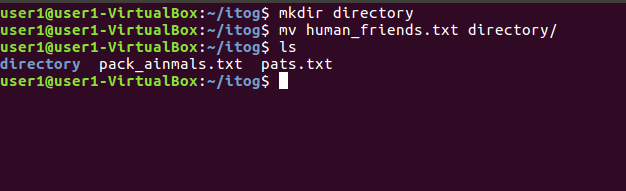
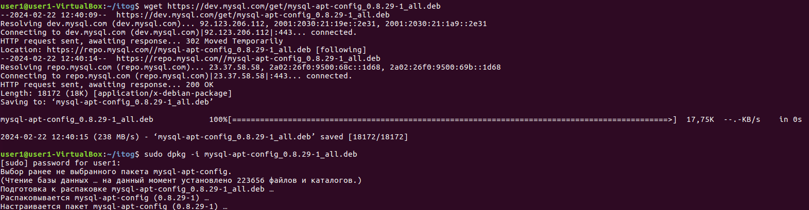
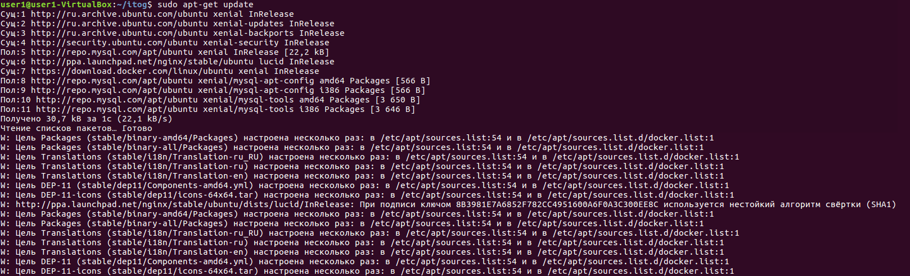
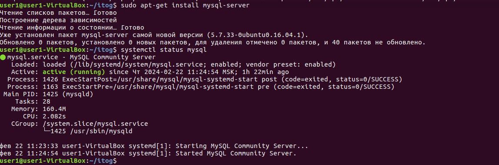
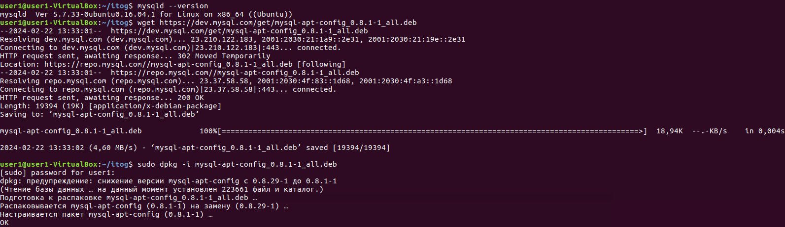
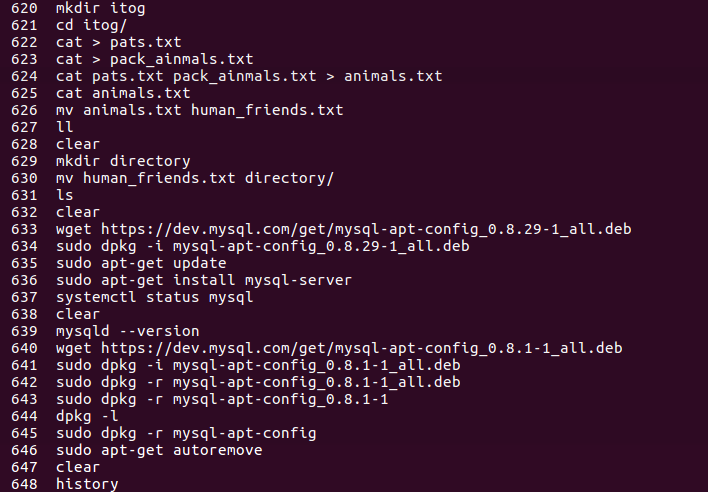
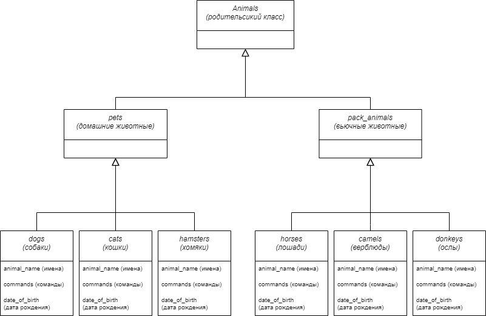

# Итоговая контрольная работа

## Информация о проекте

Необходимо организовать систему учета для питомника в котором живут домашние и вьючные животные

## Как сдавать проект

Для сдачи проекта необходимо создать отдельный общедоступный репозиторий(Github, gitlub, или Bitbucket). Разработку вести в этом репозитории, использовать пул реквесты на изменения. Программа должна запускаться и работать, ошибок при выполнении программы быть не должно. Программа, может использоваться в различных системах, поэтому необходимо разработать класс в виде конструктора

## Задание
1.Используя команду cat в терминале операционной системы Linux, создать два файла Домашние животные (заполнив файл собаками, кошками, хомяками) и Вьючные животными заполнив файл Лошадьми, верблюдами и ослы), а затем объединить их. Просмотреть содержимое созданного файла. Переименовать файл, дав ему новое имя (Друзья человека)

 Решение

 
2.Создать директорию, переместить файл туда

 Решение

 

3.Подключить дополнительный репозиторий MySQL. Установить любой пакет из этого репозитория

 Решение

 

4.Установить и удалить deb-пакет с помощью dpkg

 Решение

 

5.Выложить историю команд в терминале ubuntu

 Решение

 

6.Нарисовать диаграмму, в которой есть класс родительский класс, домашние животные и вьючные животные, в составы которых в случае домашних животных войдут классы: собаки, кошки, хомяки, а в класс вьючные животные войдут: Лошади, верблюды и ослы)

 Решение

 

7.В подключенном MySQL репозитории создать базу данных “Друзья человека”

 Решение

DROP DATABASE IF EXISTS Друзья_человека;

CREATE DATABASE Друзья_человека;

SHOW DATABASES;

USE Друзья_человека;

 

8.Создать таблицы с иерархией из диаграммы в БД

 Решение

DROP TABLE IF EXISTS dogs;

CREATE TABLE dogs (

    id INT PRIMARY KEY AUTO_INCREMENT,

    animal_name VARCHAR(45),

    commands TEXT,

    date_of_birth DATE

);

DROP TABLE IF EXISTS cats;

CREATE TABLE cats (

    id INT PRIMARY KEY AUTO_INCREMENT,

    animal_name VARCHAR(45),

    commands TEXT,

    date_of_birth DATE

);

DROP TABLE IF EXISTS hamsters;

CREATE TABLE hamsters (

    id INT PRIMARY KEY AUTO_INCREMENT,

    animal_name VARCHAR(45),

    commands TEXT,

    date_of_birth DATE

);

DROP TABLE IF EXISTS horses;

CREATE TABLE horses (

    id INT PRIMARY KEY AUTO_INCREMENT,

    animal_name VARCHAR(45),

    commands TEXT,

    date_of_birth DATE

);

DROP TABLE IF EXISTS camels;

CREATE TABLE camels (

    id INT PRIMARY KEY AUTO_INCREMENT,

    animal_name VARCHAR(45),

    commands TEXT,

    date_of_birth DATE

);

DROP TABLE IF EXISTS donkeys;

CREATE TABLE donkeys (

    id INT PRIMARY KEY AUTO_INCREMENT,

    animal_name VARCHAR(45),

    commands TEXT,

    date_of_birth DATE

);

 

9.Заполнить низкоуровневые таблицы именами(животных), командами которые они выполняют и датами рождения

 Решение

INSERT INTO cats (animal_name, commands, date_of_birth) VALUES

    ('cat_1', 'kis-kis', '2022-01-01'),

    ('cat_2', 'kis-kis', '2022-01-01'),

    ('cat_3', 'kis-kis', '2022-06-01'),

    ('cat_4', 'kis-kis', '2022-06-01'),

    ('cat_5', 'kis-kis', '2022-06-01');
   

INSERT INTO dogs (animal_name, commands, date_of_birth) VALUES

    ('dog_1', 'sit', '2022-02-01'),

    ('dog_2', 'sit', '2022-02-01'),

    ('dog_3', 'sit', '2022-07-01'),

    ('dog_4', 'sit', '2022-07-01'),

    ('dog_5', 'sit', '2022-07-01');

INSERT INTO hamsters (animal_name, commands, date_of_birth) VALUES
 
    ('hamster_1', 'eat', '2021-03-01'),

    ('hamster_2', 'eat', '2021-03-02'),

    ('hamster_3', 'eat', '2021-08-03'),

    ('hamster_4', 'eat', '2021-08-04'),

    ('hamster_5', 'eat', '2021-12-05');

INSERT INTO horses (animal_name, commands, date_of_birth) VALUES

    ('horse_1', 'br-br-br', '2020-04-01'),

    ('horse_2', 'br-br-br', '2020-05-02'),

    ('horse_3', 'br-br-br', '2020-09-03'),

    ('horse_4', 'br-br-br', '2020-10-04'),

    ('horse_5', 'br-br-br', '2020-11-05');

INSERT INTO camels (animal_name, commands, date_of_birth) VALUES
 
    ('camel_1', 'khh-khh', '2020-01-01'),

    ('camel_2', 'khh-khh', '2020-02-01'),

    ('camel_3', 'khh-khh', '2020-03-01'),

    ('camel_4', 'khh-khh', '2020-06-01'),

    ('camel_5', 'khh-khh', '2020-07-01');

INSERT INTO donkeys (animal_name, commands, date_of_birth) VALUES

    ('donkey_1', 'meal', '2021-01-01'),

    ('donkey_2', 'meal', '2021-02-01'),

    ('donkey_3', 'meal', '2021-05-01'),

    ('donkey_4', 'meal', '2021-06-01'),

    ('donkey_5', 'meal', '2021-07-01');

 

10.Удалив из таблицы верблюдов, т.к. верблюдов решили перевезти в другой питомник на зимовку. Объединить таблицы лошади, и ослы в одну таблицу

 Решение

TRUNCATE camels;

DROP TABLE IF EXISTS artiodactyls;

CREATE TABLE artiodactyls AS

SELECT * FROM horses

UNION

SELECT * FROM donkeys;

 

11.Создать новую таблицу “молодые животные” в которую попадут все животные старше 1 года, но младше 3 лет и в отдельном столбце с точностью до месяца подсчитать возраст животных в новой таблице

 Решение

DROP TABLE IF EXISTS young_animals;

CREATE TABLE young_animals AS

SELECT *, TIMESTAMPDIFF(MONTH, date_of_birth, CURDATE()) AS age_in_months

FROM (

    SELECT 'Dog' AS type_animal, animal_name, commands, date_of_birth FROM dogs

    UNION ALL

    SELECT 'Cat' AS type_animal, animal_name, commands, date_of_birth FROM cats

    UNION ALL

    SELECT 'Hamster' AS type_animal, animal_name, commands, date_of_birth FROM hamsters

    UNION ALL

    SELECT 'Horse' AS type_animal, animal_name, commands, date_of_birth FROM horses

    UNION ALL
    
    SELECT 'Donkey' AS type_animal, animal_name, commands, date_of_birth FROM donkeys

) AS animalses

WHERE date_of_birth >= DATE_SUB(CURDATE(), INTERVAL 3 YEAR)

AND date_of_birth <= DATE_SUB(CURDATE(), INTERVAL 1 YEAR);

 

12.Объединить все таблицы в одну, при этом сохраняя поля, указывающие на прошлую принадлежность к старым таблицам

 Решение

DROP TABLE IF EXISTS all_animals;

CREATE TABLE all_animals AS

SELECT 'Dog' AS type_animal, animal_name, commands, date_of_birth FROM dogs

UNION ALL

SELECT 'Cat' AS type_animal, animal_name, commands, date_of_birth FROM cats

UNION ALL

SELECT 'Hamster' AS type_animal, animal_name, commands, date_of_birth FROM hamsters

UNION ALL

SELECT 'Horse' AS type_animal, animal_name, commands, date_of_birth FROM horses

UNION ALL

SELECT 'Donkey' AS type_animal, animal_name, commands, date_of_birth FROM donkeys;

 

13.Создать класс с Инкапсуляцией методов и наследованием по диаграмме

 Решение

[Перейти к коду](./Animal_registry_java/Animals.java)

 

14.Написать программу, имитирующую работу реестра домашних животных.
  В программе должен быть реализован следующий функционал:
  _14.1_ завести новое животное
  _14.2_ определять животное в правильный класс
  _14.3_ увидеть список команд, которое выполняет животное
  _14.4_ обучить животное новым командам
  _14.5_ Реализовать навигацию по меню

 Решение

[Перейти к коду](./Animal_registry_java/Main.java)

 

15.Создайте класс Счетчик, у которого есть метод add(), увеличивающий значение внутренней int переменной на 1 при нажатие “Завести новое животное” Сделайте так, чтобы с объектом такого типа можно было работать в блоке try-with-resources. Нужно бросить исключение, если работа с объектом типа счетчик была не в ресурсном try и/или ресурс остался открыт. Значение считать в ресурсе try, если при заведения животного заполнены все поля

 Решение

[Перейти к коду](./Animal_registry_java/Counters.java)

